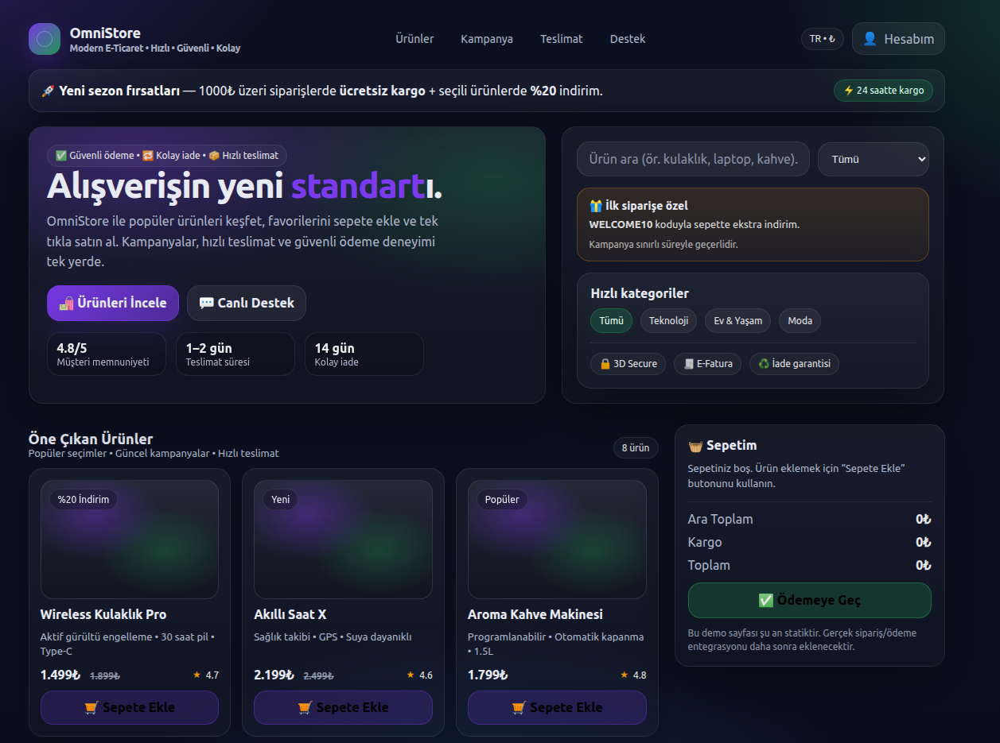
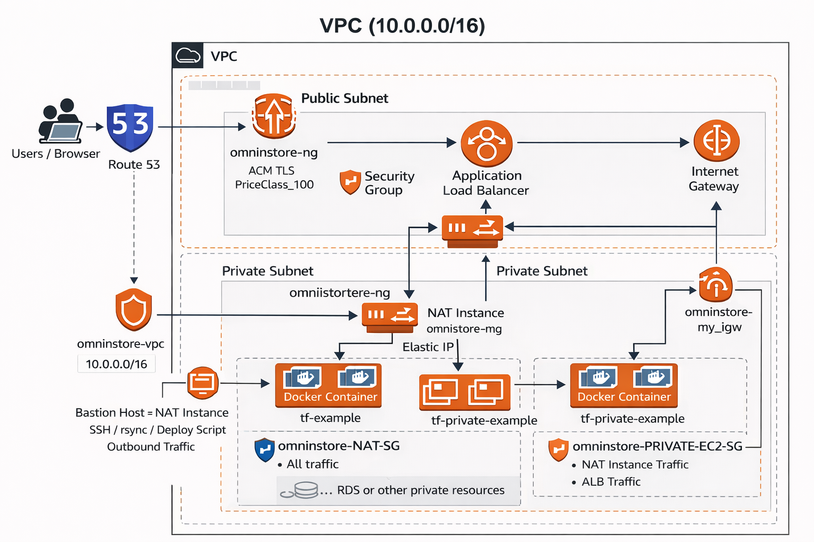

# 🛒 OmniStore

**Modern, Cloud-Native E-Commerce Infrastructure**  
*AWS · Terraform · CI/CD · Security · FinOps*

OmniStore, gerçek dünya e-ticaret senaryoları baz alınarak tasarlanmış, **güvenli, ölçeklenebilir ve maliyet odaklı** bir bulut mimarisi projesidir.  
Projenin amacı yalnızca bir uygulama çalıştırmak değil; **modern DevOps / Cloud Engineering pratiklerini uçtan uca göstermektir.**

---

## 🌐 Live Demo

🔗 **Frontend:** https://omnestore.org  
🚀 **Deployment:** GitHub Actions üzerinden otomatik

---

## 🖥️ UI Preview

> Modern e-ticaret deneyimi (statik demo – ödeme entegrasyonu yok)



---
🏗️ AWS Architecture Overview




## 🧱 Temel Bileşenler

### ☁️ Cloud & Infrastructure
- **AWS**
- **Terraform (IaC)**
- VPC (Public / Private Subnet)
- Application Load Balancer (ALB)
- CloudFront + ACM (TLS)
- Route53 (DNS)

### 🔐 Security First Design
- Application sunucuları **private subnet**
- **Public IP yok**
- SSH erişimi yalnızca **Bastion Host** üzerinden
- Least-privilege Security Groups
- IAM role-based access

### 🚀 CI/CD
- **GitHub Actions**
- Otomatik:
  - Build
  - S3 deploy
  - CloudFront cache invalidation
- Zero-downtime frontend deployment

### 💰 FinOps Odaklı Yaklaşım
- Gereksiz kaynakların önlenmesi
- Terraform `apply / destroy` lifecycle
- Managed servisler ile operasyonel yük azaltma
- CDN ile bandwidth maliyet optimizasyonu

---

## 📂 Repository Yapısı
```text
omnistore/
├── .github/
│   └── workflows/
│       └── deploy.yml          # Frontend CI/CD (GitHub Actions → S3)
│
├── docs/
│   ├── iam/                    # IAM policy & role dokümantasyonu
│   └── s3/                     # S3 AMP policy & role örnekleri
│
├── infra/                      # Terraform Infrastructure
│   ├── backend.tf              # S3 + DynamoDB state backend
│   ├── main.tf                 # Ana infrastructure tanımı
│   ├── variables.tf            # Input değişkenleri
│   ├── outputs.tf              # Terraform output’ları
│   ├── terraform.tfvars        # Ortam bazlı değişkenler (secret içermez)
│   └── modules/
│       ├── vpc/                # VPC, Subnet, Route Table
│       ├── security/           # Security Group & IAM modülleri
│       └── compute/            # EC2, ALB ve ilgili kaynaklar
│
├── omnistore-ui/               # Frontend (React)
│   ├── src/                    # React source code
│   ├── public/                 # Static assets
│   ├── dist/                   # Build çıktısı
│   ├── Dockerfile              # Frontend containerization
│   └── nginx/                  # Opsiyonel reverse proxy / ingress config
│
├── .gitignore                  # Gereksiz dosyalar
└── README.md                   # Proje dokümantasyonu
